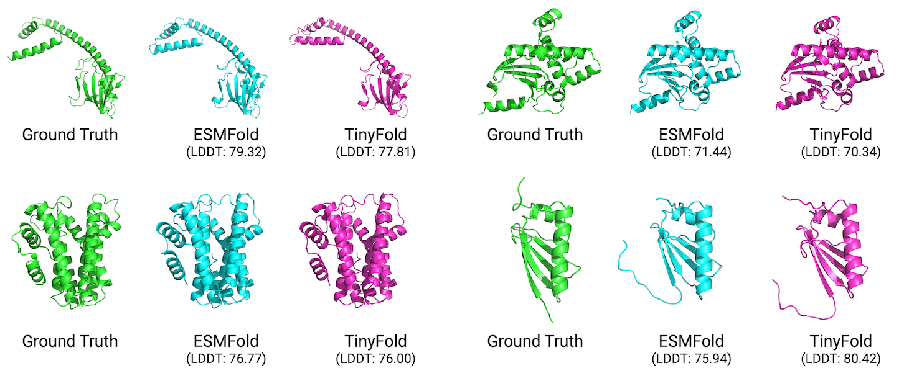

# TinyFold




https://github.com/user-attachments/assets/ef52d458-b997-4271-8275-5c57b8b57111


TinyFold is an optimized version of ESMFold implemented with pure C++ and optimized with the activation-aware weight quantization (AWQ) and the memory-efficient accumulation techniques. TinyFold reduces memory cost by approximately 6 folds and achieves a speed-up of approximately 9 folds compared to ESMFold on CPUs.

TinyFold is a final project for MIT [6.5940 TinyML and Efficient Deep Learning Computing](https://efficientml.ai/) (Fall 2024).

Authors: [Shitong Luo](https://luost.me/)\*, [Yu-Cheng Wu](https://peterwu-1031.github.io/)\* (\*equal contribution, alphabetical order by last name)

## Run TinyFold

1. Download and unarchive the pre-compiled TinyFold from [releases](https://github.com/luost26/tinyfold/releases).
2. Download and unarchive the model weights from [here](https://www.dropbox.com/scl/fi/xfu3b4pwjz399y4n5eop5/tinyfold_awq.tar.gz?rlkey=5ox6dtwepmc1zcjoz6677g4k9&st=887nqbfh&dl=0).
3. Run TinyFold and input a protein sequence (10 demo sequences are provided [here](data/testset/family_0_sequences.txt))
   ```bash
   ./tinyfold <path-to-weights>
   ```
4. To view the predicted structure, drag the output `.pdb` file to [molstar.org/viewer](https://molstar.org/viewer).

## Compile from Source

### Prerequisite

CMake and OpenMP are required to compile TinyFold. On macOS, these dependencies can be installed using homebrew:

```
brew install cmake libomp
```

### Compile

Use the following commands to compile TinyFold:

```
mkdir build
cd build
cmake ..
make
```

The compiled executable binary can be found at `build/tinyfold`.

## Export Pre-trained Weights from Scratch

### Prerequisite

Install the conda environment using the commands below:

```bash
conda env create --name tinyfold --file env.yml
conda activate tinyfold
pip install -e .
```


### Pre-trained Weights of ESMFold

Download pre-trained model weights and SCOP datasets using the following script:

```bash
bash ./data/download_all.sh
```

### Export Weights (w/o AWQ)

```bash
python ./scripts/export_esmfold.py --out <export-path>
```

### Export Weights (w/ AWQ)

First, generate calibration data:

```bash
python ./scripts/create_testset.py
```

Next, export weights with AWQ scaling factors:

```bash
python ./scripts/export_esmfold.py --out <export-path> --awq
```

### Quantization

The exported weights are in FP32. To quantize the weights, use the `export_quantized_weights` compiled from C++:

```bash
./build/export_quantized_weights <input-fp32-weight-path> <output-quantized-weight-path>
```

## Miscellaneous

### Generate Unit Test Data

```bash
python ./scripts/generate_test_data.py <test-case-name>
```

### Visualize Weights and Activations Before/After AWQ

```bash
python ./scripts/awq_visualization.py <--layer {visualized-layer} (optional)>
```

If `visualized-layer` is not provided, the qkv projection layers in the second Transformer layer `esm.layers.1` will be visualized in `data/output/awq`.

